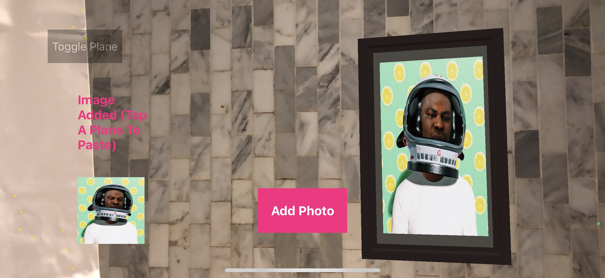

# ARPhotoViewerDemo

# Overview

This is a demo app that allows users to add picture from their camera roll to a vertical plane (like a wall).
The pictures are added with a picture frame, which is a 3D model brought it from echoAR.

# Screenshots

