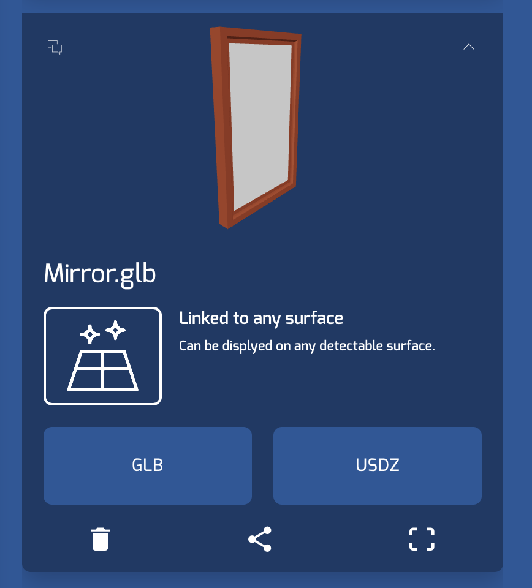

# ARPhotoViewerDemo (iOS Swift echoAR Demo)

# Overview

This is a demo app that allows users to add picture from their camera roll to a vertical plane (like a wall).
The pictures are added with a picture frame, which is a 3D model brought in from echoAR.

# Setup
* Clone this project and open in Xcode 
* Set your echoAR API key in the EchoAR.swift file
* Add a picture frame models to echoAR console (you can search and find one on the platform itself) 
* Note: this demo is using a mirror 3D model as the picture frame
* Add the entry id of your picture frame model, to the ViewController.swift file

# Run
* [Build and run the AR Application](https://docs.echoar.xyz/swift/adding-ar-capabilities)

# Learn more 
Refer to our [documentation](https://docs.echoar.xyz/swift/installation) to learn more about how to use Swift and echoAR.

# Support
Feel free to reach out at <support@echoAR.xyz> or join our [support channel on Slack](https://app.slack.com/client/TENTAKZ7V/G01AV799NLR).

# Screenshots

